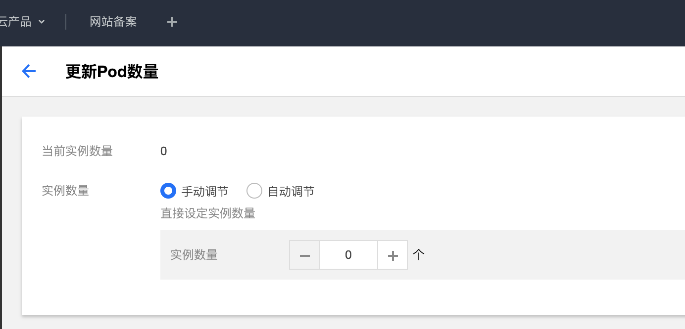

## 3.5.3 服务级别跨地域容灾

背景：网站业务团队希望所有的服务具备跨地域容灾的能力，如果其中一个地域的服务故障后，访问该服务的流量会被自动切换到另一地域。

TCM提供服务跨地域容灾的能力。

首先，通过TKE集群控制台将上海地域的product-v2 deployment的pod数量配置为0，模拟上海地域product服务的故障情况。

配置完成后，通过上海集群边缘代理网关的IP地址访问Demo电商网站，即使现在上海地域的product服务处于故障状态，商品页面还是可以正常访问，通过左下角悬浮窗会查看服务调用情况会发现当前页面调用的是广州地域的product服务，上海地域访问product服务的请求被路由到了广州的product服务，实现了服务级别的跨地域容灾。

