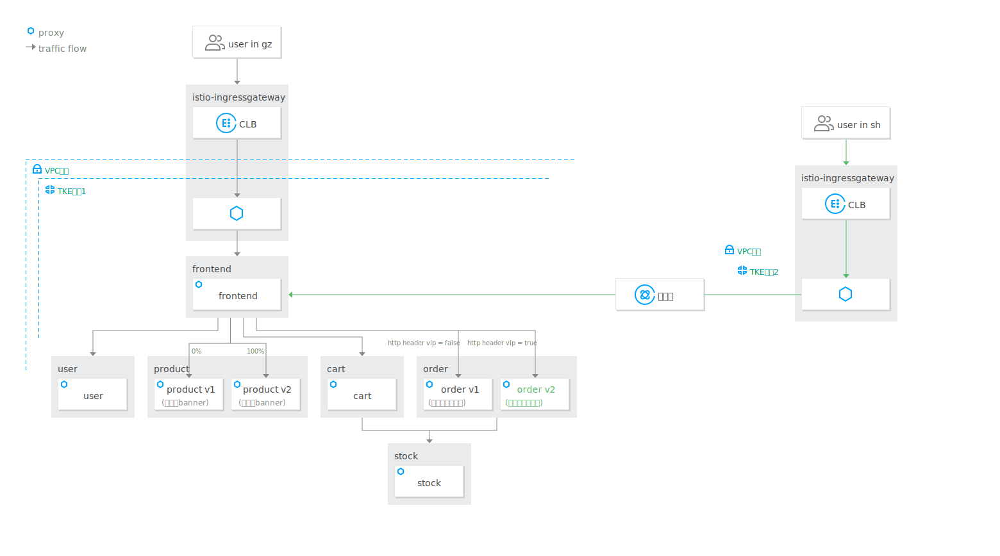
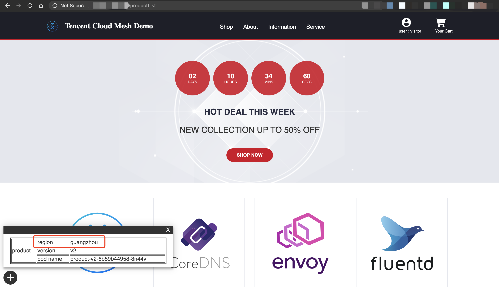

## 3.5.1 就近接入



背景：随着电商网站业务规模的扩张，网站的业务从广州扩展至上海，业务团队希望上海的网站用户能通过上海的网关就近接入，请求通过腾讯云内网将访问请求转到广州的业务集群，上海与广州的VPC通过云联网打通。广州的网站用户还是通过广州的网关接入广州集群。

应用以下配置到主集群，gateway配置上海集群边缘代理网关的监听器规则，放通80端口，http协议，VirtualService配置将来自边缘代理网关的流量路由至frontend服务。

```yaml
kubectl apply -f - <<EOF
apiVersion: networking.istio.io/v1alpha3
kind: Gateway
metadata:
  name: frontend-gw-sh
spec:
  servers:
    - port:
        number: 80
        name: http
        protocol: HTTP
      hosts:
        - '*'
  selector:
    app: istio-ingressgateway-1
    istio: ingressgateway

---
apiVersion: networking.istio.io/v1alpha3
kind: VirtualService
metadata:
  name: frontend-vs
  namespace: base
spec:
  hosts:
    - '*'
  gateways:
    - base/frontend-gw
    - base/frontend-gw-sh
  http:
    - route:
        - destination:
            host: frontend.base.svc.cluster.local
EOF
```

配置完成后，通过上海的边缘代理网关IP地址即可访问到电商网站，即使上海的集群中没有部署电商网站相关服务，因为流量被跨地域路由到了广州的服务。


