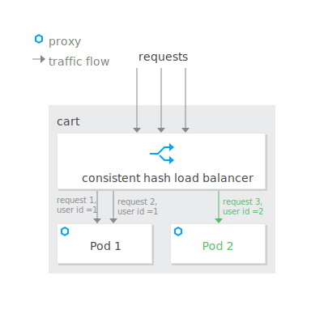

## 3.3 会话保持——一致性hash负载均衡策略



背景：购物车服务由多个pod副本运行，需要会话保持功能，以保证同一用户请求被路由至同一个pod，保证同一用户的购物车信息不会丢失。

会话保持功能可通过设置cart服务DestinationRule的负载均衡策略实现，以请求中header中的UserID做一致性hash负载均衡。

```yaml
kubectl apply -f - <<EOF
apiVersion: networking.istio.io/v1alpha3
kind: DestinationRule
metadata:
  name: cart
  namespace: base
spec:
  host: cart
  trafficPolicy:
    loadBalancer:
      consistentHash:
        httpHeaderName: UserID
  exportTo:
    - '*'
EOF
```

配置完成后，可在登陆状态多次点击“Your Cart”或点击“ADD TO CART”调用cart服务验证会话保持功能，同一用户的多次请求会被路由至同一个pod，左下角悬浮窗可查看提供cart服务的pod name。同一用户多次请求的pod name不会变化。

