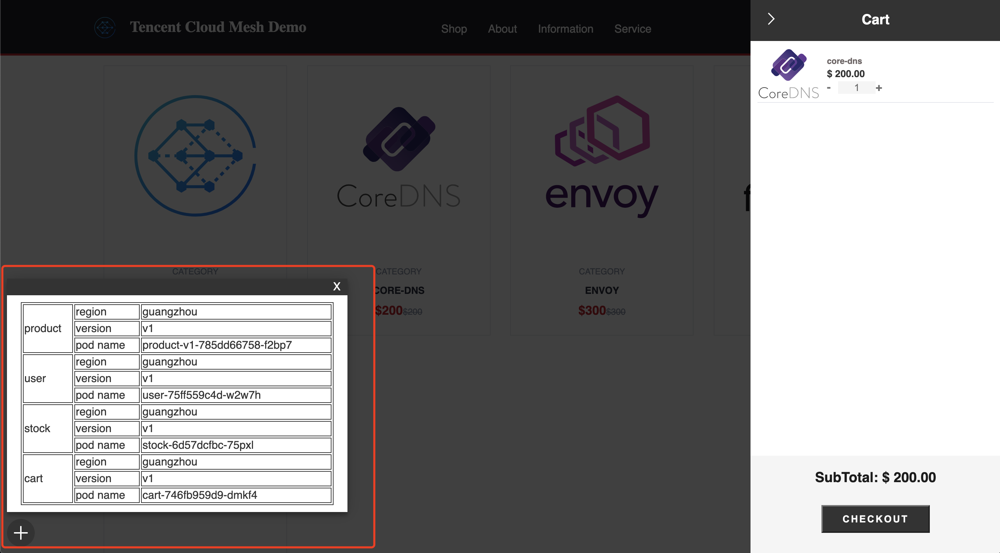

## 2.1 配置公网访问

体验环境创建完成后，网站所有服务已经部署至广州的集群（product服务和order服务只部署了v1版本），并且已自动注入了envoy sidecar接管服务流量，istio-ingressgateway已经创建，但未配置监听器规则以及路由规则以放通网站frontend服务至公网。

首先需要创建Gateway资源，配置istio-ingressgateway的监听器规则，端口为80，协议为http。用户只需要配置Gateway规则，TCM后台会自动实现istio-ingressgateway相关的pod，service和绑定的负载均衡器CLB的配置同步。

监听器规则配置完成后，还需要通过Virtual Service资源配置路由规则，将来自istio-ingressgateway的流量路由至frontend服务。

配置完成后，通过istio-ingressgateway的公网IP地址即可访问到Demo网站，当前部署的网站的结构如下：

点击链接访问网站后，可登陆、添加购物车，下单，以产生调用完所有部署的服务的请求，网站界面右下角的悬浮窗展示了前端服务当前调用服务的名称、地域、版本、pod name信息。

有流量数据后，可点击网络拓扑tab可查看网格内网络流量的拓扑图。点击服务tab，服务详情页面可查看到请求的调用链，可查看调用stock服务的完整链路及每层调用的详细信息。

业务规模增加，服务数量较多时，几乎每个前端请求都会形成复杂的调用链路，此时需要能够：在复杂的链路中快速定位和分析问题，判定故障影响范围；或需要梳理服务的调用依赖关系，判断其合理性；或分析链路的请求耗时等性能，做串并行分析的调用逻辑优化等。

通过全链路跟踪系统，可描绘整个网格的流量特征，帮助开发者进行链路分析。

